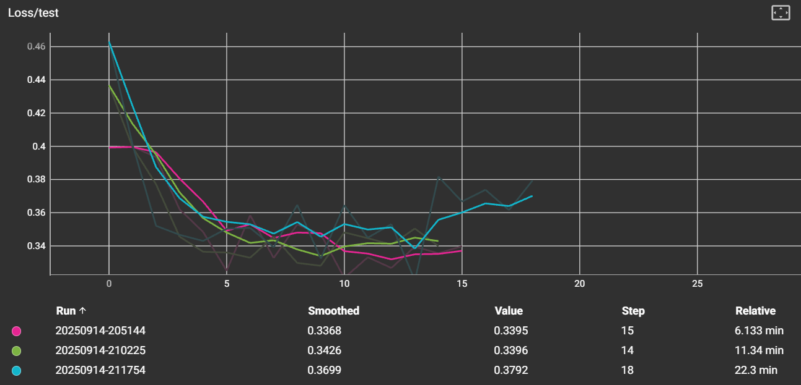
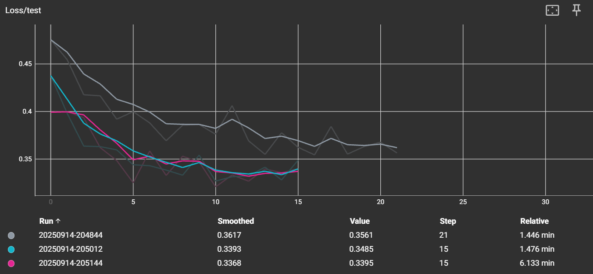

# Report

## Hypothesis

Neural networks with more layers or more units per layer take more epochs to train. Increasing the number of layers and units can also improve the accuraccy up untill the point where it becomes to complex the the model will start to overfit.  

## Experiment

Perform a grid search with 2,3,4 layers, with all 32, 128 or 512 units. Train with early stop to see at what epoch the performance stops improving. Early stop is used when there is no improvement in the past 5 epochs.

## Results

When looking at the 2 layer models, the one with 32 units each layer needs more 21 epochs to get to an accuarcy of 87%, while the networks with 128 and 512 units take only 15 epochs to train and both reach an accuracy of 89%. The 3 layer models show a similar pattern. The models with 32 units and 128 units per layer take 20 to 22 epochs training, where the 32 units model gets to 88% accuracy and the 128 units model to 89%. The 3 layered model with 512 units per layer only needs 14 epochs to get to 89% accuracy. The 3 layer model shows the flipped effect, the 32 layer model only need 14 epochs to get to 87% accuarcy while the ohter take 19 epochs to get to 89%. Figure 1 shows the loss of the 512 units. After the initial 2 epochs all 3 models show a similar learning curve. The error score of the 4 layered model even start to increase after 13 epochs, indicating that might be overfitting due to the high complexity of the model. In Figure 2 it shows that the 2 layered model with 32 units cannot capture the complexity as well as the 128 units model and the 512 units model.

Figure 1. Line graph of loss per epoch during learning of the 512 unit models of the 2 layered model (pink), 3 layered model (green) and the 4 layered model (blue).

Figure 2. Line graph of loss per ecoch during training of the 2 layered models of 32 units (grey), 128 units (blue) and 512 units (pink).

To conclude, increasing the number of units or layers increases the accuarcy, but on this relativly simple dataset this is goals is already reached with 3+ layers or 128+ units per layer. Increasing the number of layers or units further will not improve accuarcy, it might even reduce the performance of the model due to overfitting. 