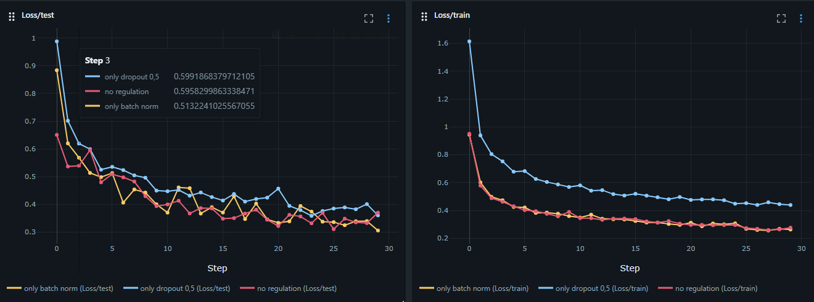

# Report

## Hypothesis

I am interested in the effect of the following parameters of a convolution network for image classification of different sizes.

- kernel size
- number of kernels
- the use of padding
- different methods op pooling; max pooling, mean pooling or down sampling

I think larger images need a bigger kernel size and higher number of kernels to capture its complexity. I also expect not using padding has more influence on training a model for smaller images than it is for larger images because you lose a larger fraction of the data. Finally, I suspect that the pooling method should not make a different as they all make a summary of the features.

When having found well working settings, I want to experiment if using batch normalizations and/or using dropout layers can improve the accuracy of the models.

## Experiment 1. gridsearch on fashion dataset

The fashion dataset was analyzed using a grid search.

```python
# Grid search of fashion dataset
search_space = {
    "filters": hp.choice("filters", [8, 64, 128]),
    "kernel_size": hp.choice("kernel_size", [1, 2, 3]),
    "stride": hp.choice("stride", [1, 2]),
    "pooling_method": hp.choice("pooling_method", [nn.MaxPool2d, nn.AvgPool2d]),
    "padding": hp.choice("padding", ["same", "valid"]),
    "units1": hp.choice("units1", [128]),
    "units2": hp.choice("units2", [64]),
    "epochs": hp.choice("epochs", [10]),
}
```

### Results 1

Kernel size of 1 gives the worst results, which is probably because it cannot extract any patterns. Also stride of 2 did not work, because the image ends up being to small.
When comparing the accuracy, the models with kernel size of 2 and 128 filers performs best, getting up to an accuracy of 0,76 with 10 epochs. The average pooling in this case performs less then the max pooling.

## Experiment 2. gridsearch on flower dataset

As the flower dataset contains an input of more dimensions, kernel with larger formats for this dataset are tried and a higher number of filters. The batch size and number of epochs is decreased to make training faster.

```python
search_space = {
    "filters": hp.choice("filters", [64, 128, 256, 512]),
    "kernel_size": hp.choice("kernel_size", [1, 2, 3, 4, ,5, 6]),
    "stride": hp.choice("stride", [1, 2, 3, 5]),
    "pooling_method": hp.choice("pooling_method", [nn.MaxPool2d, nn.AvgPool2d]),
    "padding": hp.choice("padding", ["same", "valid"]),
    "units1": hp.choice("units1", [128]),
    "units2": hp.choice("units2", [64]),
    "epochs": hp.choice("epochs", [10]),
}
```

### Results 2

As expected, the bigger images require larger filters to capture the patters of the image. Here the max pooling seems to outperform the avg pooling as well. What does strike me is that the high number of filters do not necessarily perform better. The 3 best performing models have 128 to 256 filters, but not the 512. Padding does not make a big difference in performance.

## Experiment 3. effect of dropout and batch normalization

I extended the first experiment with a dropout layers in the dense part of the network and including batch normalization. 

```python
"dropout1": hp.choice("dropout1", [0, 0.3, 0.5]),
"dropout2": hp.choice("dropout2", [0, 0.3, 0.5]),
"use_batchnorm": hp.choice("use_batchnorm", [True, False]),
```

### Results 3

Both seem to have a positive effect on the performance. Dropout shows a training error closer to actual error. Both batch normalization and dropout show a slightly slower learning curve compared to the training without regulation.
