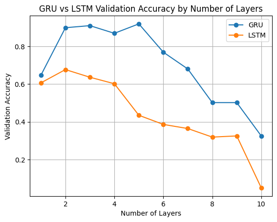

# Report

## Experiment 1. GRU vs LSTM, number of layers

Because the data is not very complex, I think both GRU and LSTM are able to learn the patterns, but because GRU is a simpler model, it might need more layers to get to the same accuracy. To train this I used 10 epoch for comparison, as doing more both GRU and LSTM already gave a high accuracy during exploration runs.

### Results 1

When plotting the accuracy, GRU outperforms LSTM. The LSTM model might be to complicated for the data or needs more epoch to fit the data correctly. For both algorithms 2 to 3 layers seem to work the best.

## Experiment 2. Influence of adding convolutional layer

Adding a convolutional layer should make it easier to pull out patterns. Again training is done using 10 epochs.

### Results 2

For 1 and 2 layered RNN models, a convulutional layer seem the help, while looking at the 3 layered RNN models, the one without a convolution layer performs better. This might be the point where the convolution + the 3 RNN layers are to complex and overfitting starts to play a role.

