# Hypertuning assignment

## Dataset

For this assignment the CIFAR10 dataset is used. It contains small RGB images of 10 classes, each class has 60000 images (50000 training and 10000 test).

## 1. Type of model

Before fine tuning any model, I want to compare the learning curve of a neural network (NN) with and without residual layers with a convolutional neural network (CNN). Based on the theory, the should learn better with less epochs as it is able the find patterns in the images.

I trained 2 neural networks with 5 layers, one with residual layers added. Then one CNN with 3 layers of 64 filters with kernel size of 3 followed by 2 fully connected layer. In the figures below it is clear that the CNN is able to reach higher accuracy within 10 epochs. Both the NN's reach a accuracy of around 45% and the CNN 73%, but taking longer to train (on cpu).

<table>
    <tr>
        <th>NN</th>
        <th>NN with Residual Layers</th>
        <th>CNN</th>
    </tr>
    <tr>
        <td>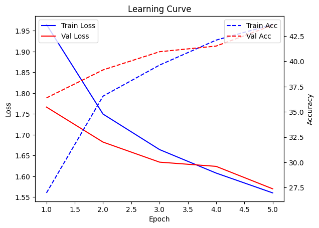</td>
        <td>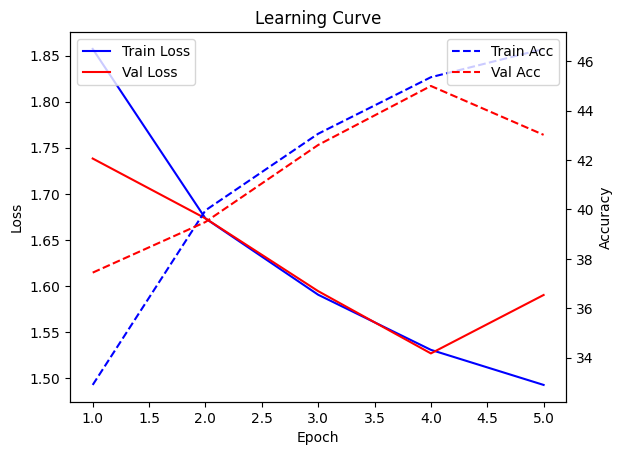</td>
        <td>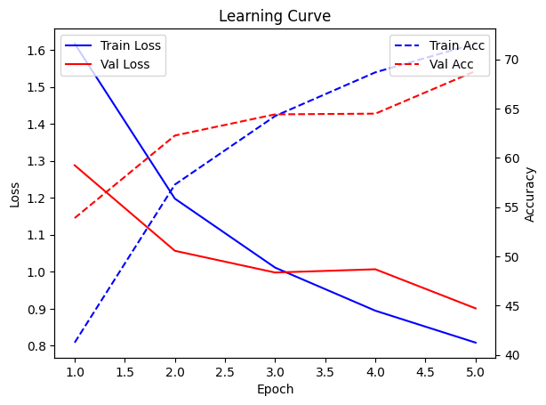</td>
    </tr>
</table>

## 2. Grid search for structure of CNN

To get a better feeling for how the CNN should look like, I performed a grid search with the following variables:

```python
{
    "num_fully_connected_layers": tune.grid_search([2,4]),
    "num_conv_layers": tune.grid_search([2,3,4]),
    "filters": tune.grid_search([64,128,152]),
    "kernel_size": tune.grid_search([2,3]),
}
```

As training is not very fast, I only used 3 epochs per model configuration. In general more filters performed better, while more than 2 convolutional layers does not increase performance (see heatmap). Also a kernel size of 3 performs slightly better than 2 and increasing the number of fully connected layers does not improve the validation accuracy. 

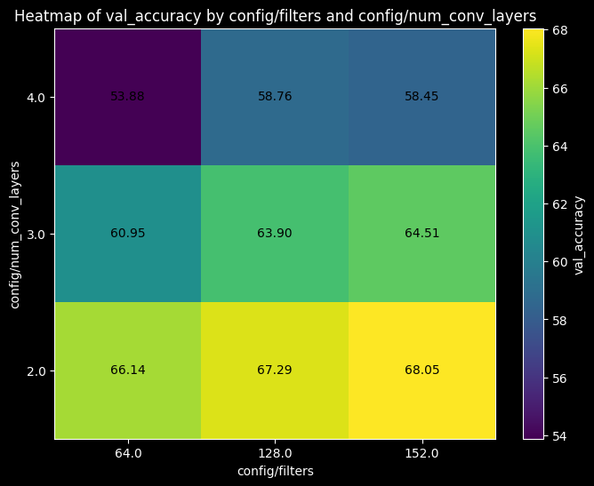

## 3. Hyperband tuning to get optiomal structure of CNN

To explore the possible structures further, I performed a hyperband tuning, with 20 possible samples, setting grace_period to 3 and the max number of epochs to 10, optimizing on validation loss.

```python
{
"hidden_size": tune.randint(254, 512),
"filters": tune.randint(100, 200),
"kernel_size": tune.randint(2, 3),
"padding": tune.randint(0, 1),
}
```

Although the training showed improved performance, the train_loss and validation loss started to diverge around 6 epochs, suggesting the model is overfitting.

Trying to get the model to learn the patterns better, so overfitting can be avoided I added a crop and horizontal flip to the data loader transformer. As visible in the images below, it does not completely remove the overfitting effect, but limits it

<table>
    <tr>
        <td>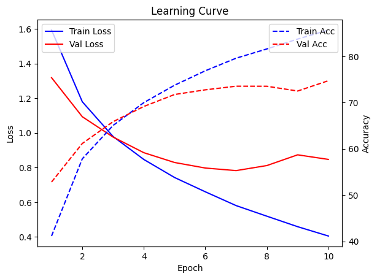</td>
        <td>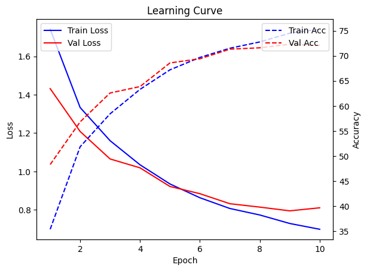</td>
    </tr>
    <tr>
        <td align="center">Train vs Validation Loss before applying transformations</td>
        <td align="center">Train vs Validation Loss after applying transformations</td>
    </tr>
</table>

Best configuration before adding transformers:
- hidden_size: 378
- filters: 100
- kernel_size: 2
- padding: 0

Resulting in 72.83% accuracy on the test set in 10 epochs

Best configuration after adding transformers:
- hidden_size: 415
- filters: 146
- kernel_size: 2
- padding: 0

Resulting in 73.18% accuracy on the test set in 10 epochs.

## 4. Improve model hyperparameters with Hyperband scheduler

Trying to improve the performance, I wanted to see if I can implement residual layers, batch normalization and dropout. To try as many possibilities, without having to wait for days, I used the hyperband scheduler. Here I also used different batch_sizes to see if that might influence the accuracy. These are the 5 best performing settings and their performance:

| Trial ID      | Train Loss | Val Loss | Train Acc (%) | Val Acc (%) | BatchNorm | Dropout | Filters | Hidden Size | Kernel Size | Padding | Residual | Batch Size | Num Conv Layers | Training Iterations |  
|---------------|------------|----------|---------------|-------------|-----------|---------|---------|-------------|-------------|---------|----------|------------|------------------|---------------------|  
| 1f9b5_00006   | 0.5861     | 0.7070   | 79.52         | 75.71       | False     | 0.3     | 109     | 397         | 2           | 0       | False    | 64         | 2                | 50                  |  
| 1f9b5_00007   | 0.5941     | 0.7171   | 79.17         | 75.37       | False     | 0.3     | 118     | 452         | 2           | 0       | False    | 64         | 2                | 50                  |  
| 1f9b5_00011   | 0.6453     | 0.7237   | 77.19         | 74.45       | True      | 0.3     | 223     | 354         | 2           | 0       | True     | 64         | 2                | 50                  |  
| 1f9b5_00027   | 0.5605     | 0.7365   | 80.25         | 74.74       | False     | 0.2     | 107     | 263         | 2           | 0       | True     | 64         | 2                | 50                  |  
| 1f9b5_00036   | 0.4712     | 0.7577   | 83.20         | 75.21       | False     | 0.1     | 204     | 321         | 2           | 0       | True     | 64         | 2                | 32                  |  

To see if the mistakes that are still made by the model is logical, I created a confusion matrix and had a look at some of the mislabeled images:

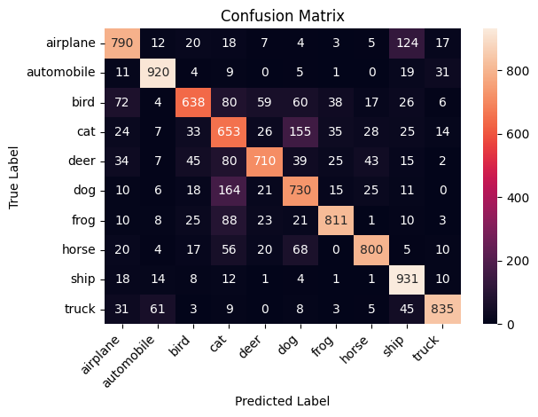

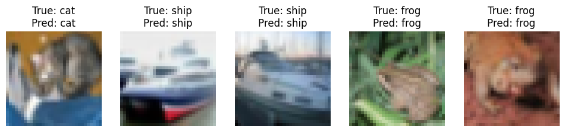

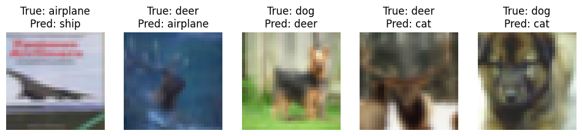

There are some classes that are often mismatched. Like the airplane and ship, that might be due to both having a blue background. And dog, cat and deer, probably due to having similar features like legs, head and body. 

## 5. Comparison with transfer learning

I expect that a model that is pre-trained can faster learn, as it already recognizes patterns in images. I tried the Resnet18 and Resnet34 and compared them to my own trained model. Looking at the learning curve, the resnet models are indeed able to learn much faster, hitting a accuracy of 80% or more within 4 epochs, where it took me over 30 epoch to hit 75% accuracy.

The Resnet18 model already contains enough complexity to capture the patterns in the images. Compared to the Resnet34 it shows a similar performance with less overfitting.

<table>
    <tr>
        <th>Best CNN model</th>
        <th>Resnet18</th>
        <th>Resnet34</th>
    </tr>
    <tr>
        <td>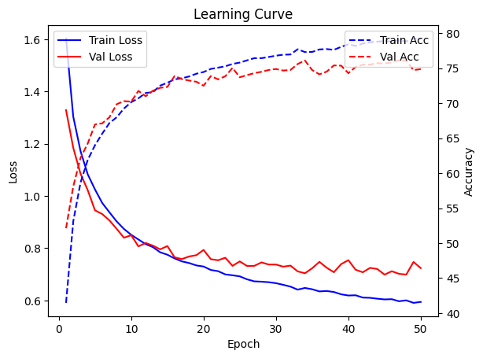</td>
        <td>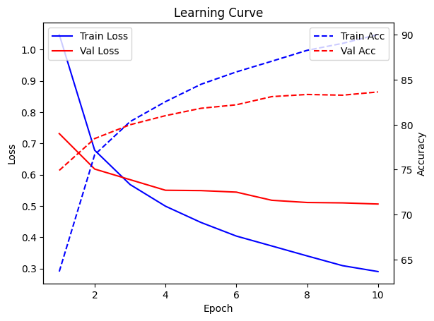</td>
        <td>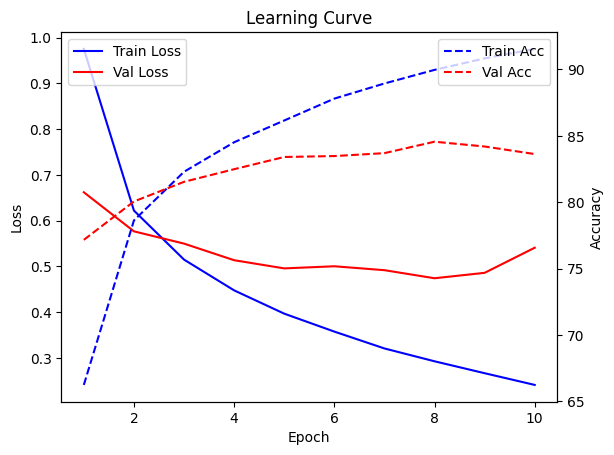</td>
    </tr>
</table>

When looking at the confusion matrix of the resnet18 model, it still shows some similar mistakes. The dogs and cat classes are still often mistaken. but the distinction between airplane and ship is now much better predicted. 

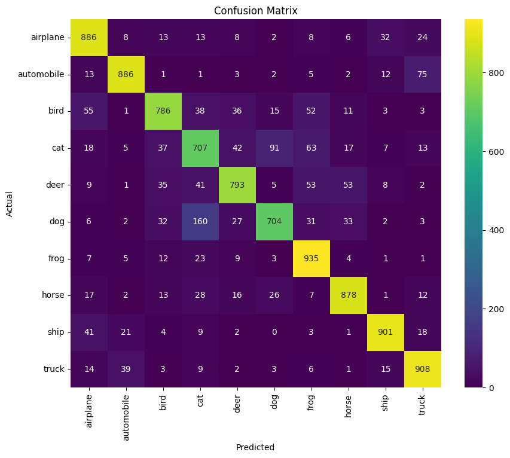