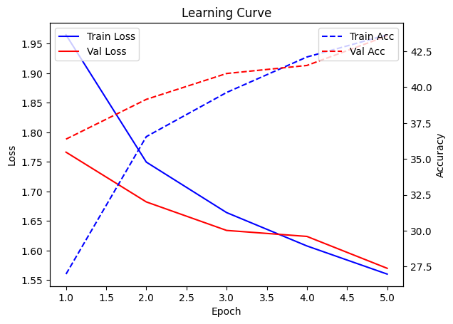
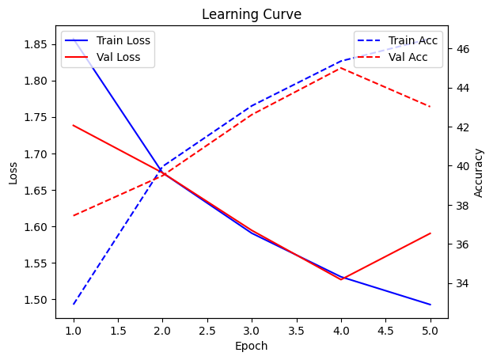
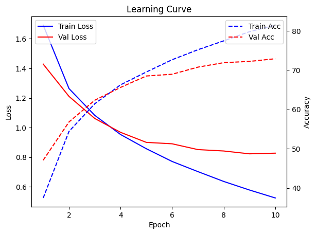

# Hypertuning assignment

## Dataset

For this assignment the CIFAR10 dataset is used. It contains small RGB images of 10 classes, each class has 60000 images (50000 training and 10000 test).

## 1. Type of model

Before fine tuning any model, I want to compare the learning curve of a neural network (NN) with and without residual layers with a convolutional neural network (CNN). Based on the theory, the should learn better with less epochs as it is able the find patterns in the images.

I trained 2 neural networks with 5 layers, one with residual layers added. Then one CNN with 3 layers of 64 filters with kernel size of 3 followed by 2 fully connected layer. In the figures below it is clear that the CNN is able to reach higher accuracy within 5 epochs

<table>
    <tr>
        <th>NN</th>
        <th>NN with Residual Layers</th>
        <th>CNN</th>
    </tr>
    <tr>
        <td></td>
        <td></td>
        <td></td>
    </tr>
</table>

## 2. Grid search for structure of CNN
