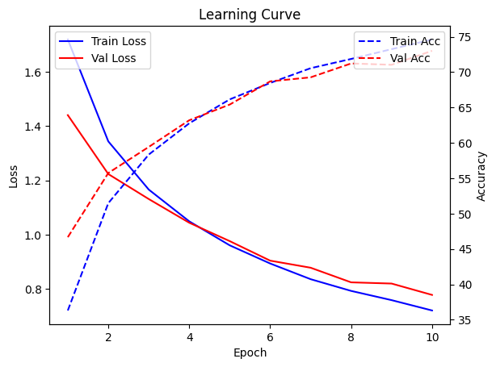

# Hypertuning assignment

## Dataset

For this assignment the CIFAR10 dataset is used. It contains small RGB images of 10 classes, each class has 60000 images (50000 training and 10000 test).

## 1. Type of model

Before fine tuning any model, I want to compare the learning curve of a neural network (NN) with and without residual layers with a convolutional neural network (CNN). Based on the theory, the should learn better with less epochs as it is able the find patterns in the images.

I trained 2 neural networks with 5 layers, one with residual layers added. Then one CNN with 3 layers of 64 filters with kernel size of 3 followed by 2 fully connected layer. In the figures below it is clear that the CNN is able to reach higher accuracy within 5 epochs  -

<table>
    <tr>
        <th>NN</th>
        <th>NN with Residual Layers</th>
        <th>CNN</th>
    </tr>
    <tr>
        <td></td>
        <td></td>
        <td></td>
    </tr>
</table>

## 2. Grid search for structure of CNN

To get a better feeling for how the CNN should look like, I performed a grid search with the following variables:

```python
{
    "num_fully_connected_layers": tune.grid_search([2,4]),
    "num_conv_layers": tune.grid_search([2,3,4]),
    "filters": tune.grid_search([64,128,152]),
    "kernel_size": tune.grid_search([2,3]),
}
```

As training is not very fast, I only used 3 epochs per model configuration. In general more filters performed better, while more than 2 convolutional layers does not increase performance (see heatmap). Also a kernel size of 3 performs slightly better than 2 and increasing the number of fully connected layers does not improve the validation accuracy.


## 3. Hyperband tuning to get optiomal structure of CNN

To explore the possible structures further, I performed a hyperband tuning, with 20 possible samples, setting grace_period to 3 and the max number of epochs to 10, optimizing on validation loss.

```python
{
"hidden_size": tune.randint(254, 512),
"filters": tune.randint(100, 200),
"kernel_size": tune.randint(2, 3),
"padding": tune.randint(0, 1),
}
```

Although the training showed improved performance, the train_loss and validation loss started to diverge around 6 epochs, suggesting the model is overfitting.

Trying to get the model to learn the patterns better, so overfitting can be avoided I added a crop and horizontal flip to the data loader transformer. As visible in the images below, it does not completely remove the overfitting effect, but limits it

<table>
    <tr>
        <td></td>
        <td></td>
    </tr>
    <tr>
        <td align="center">Train vs Validation Loss before applying transformations</td>
        <td align="center">Train vs Validation Loss after applying transformations</td>
    </tr>
</table>

Best configuration before adding transformers:
hidden_size: 378
filters: 100
kernel_size: 2
padding: 0

Best configuration when adding transformers:
hidden_size: 415
filters: 146
kernel_size: 2
padding: 0

## 4. Improve model hyperparameters with BOHB (Bayesian Optimization HyperBand) 

